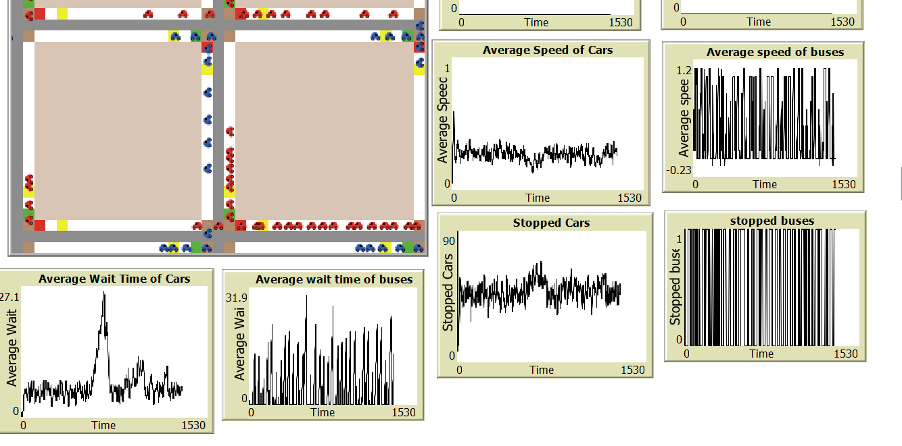

## Traffic Signal Timing Optimization Using Agent-Based Modeling
Used Netlogo

### Project Overview
This project simulates a traffic system using agent-based modeling in NetLogo. The goal is to optimize traffic signal timing to improve vehicle flow, minimize stops, and reduce wait times. Vehicles are represented as agents, moving along a road and responding to traffic signals. This project includes different types of vehicles (cars and buses) and considers multiple directions of movement, each adjusting speed and behavior based on traffic light changes.

### Features
- **Traffic Flow Control**: The model manages vehicle speeds, making adjustments when they approach traffic signals. Vehicles slow down when the signal turns red and speed up when it turns green, reflecting real-world driving behavior.
- **Dynamic Color Changes**: The traffic signals change colors based on specific conditions, which helps in controlling the flow of traffic efficiently.
- **Data Recording**: The simulation records data on vehicle stops, wait times, and the number of vehicles slowed, providing insights into traffic behavior under different conditions.

### Screenshots

